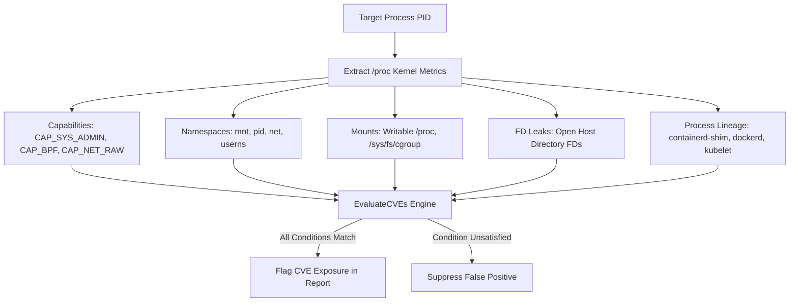

# nspect CVE Vulnerability Engine Architecture & Runtime Evaluation Matrix

Unlike traditional vulnerability scanners (e.g., Trivy, Grype) that rely strictly on static package version string comparisons (e.g., `runc 1.0.0-rc2`), **`nspect` employs a dynamic runtime condition evaluation matrix**.

It inspects the target process's **live Linux kernel state** (capabilities, namespace isolation, file descriptor leaks, `/proc` and `/sys` mount flags, `NoNewPrivileges` status, and process tree lineage) to determine if all prerequisite conditions for exploiting a specific vulnerability are actively present.

---

## 1. Static Package Scanning vs. Dynamic Runtime Evaluation

| Metric / Dimension | Traditional Scanners (Trivy, Grype) | `nspect` CVE Engine |
| :--- | :--- | :--- |
| **Primary Mechanism** | Static string matching on package version strings. | Dynamic runtime inspection of `/proc/[pid]/` kernel boundaries. |
| **False Positive Rate** | High (triggers alerts if a package is installed, even if hard-sandboxed). | Low (only triggers if active runtime conditions allow exploitation). |
| **Air-Gapped Operation** | Requires large offline vulnerability databases. | Statically embedded zero-dependency database (`cve_db.go`). |
| **Exploit Vector Context** | Package version numbers. | Real kernel capability sets, mount flags, and FD leaks. |

---

## 2. Runtime Evaluation Prerequisite Matrix (`CVERule`)

When a process is audited (`nspect --pid <PID>`), the engine executes `EvaluateCVEs(report)`. A CVE is flagged in Section `[12]` **only if ALL required runtime prerequisites for that rule are satisfied**:

### Detailed CVE Prerequisite Table

| CVE ID | Title / Vulnerability | Component | Exploitation Prerequisites (`CVERule`) | Runtime Detection Method |
| :--- | :--- | :--- | :--- | :--- |
| **`CVE-2024-21626`** | Leaky Vessels: runc Host FD Escape | runc / Docker | `RequireHostFDLeak = true` `RequireContainerized = true` | Scans `/proc/[pid]/fd/*` for leaked host directory file descriptors (e.g. `/var/lib/docker`). |
| **`CVE-2022-0492`** | cgroupv1 `release_agent` Breakout | Kernel / cgroups | `RequireCAPSysAdmin = true` `RequireWritableSys = true` `RequireContainerized = true` | Verifies `CAP_SYS_ADMIN` capability AND checks `/proc/[pid]/mountinfo` for writable `/sys/fs/cgroup`. |
| **`CVE-2020-15257`** | containerd-shim Socket Exposure | containerd | `RequireSharedNetNS = true` `RequireContainerized = true` `RequireContainerRuntime = true` | Verifies `net` NS matches host PID 1 AND checks process tree ancestor chain for `containerd-shim`. |
| **`CVE-2019-5736`** | runc `/proc/self/exe` Overwrite | runc / Docker | `RequireHostRootEUID = true` `RequireNoNewPrivsNo = true` `RequireWritableProc = true` | Evaluates EUID `0`, `NoNewPrivileges=0` in `/proc/[pid]/status`, and writable `/proc` mount point. |
| **`CVE-2023-2163`** | eBPF Verifier Memory Escalation | Kernel eBPF | `RequireCAPBPF = true` (or `CAP_SYS_ADMIN`) | Evaluates `CAP_BPF`/`CAP_SYS_ADMIN` capabilities and `sysctl kernel.unprivileged_bpf_disabled`. |
| **`CVE-2021-3493`** | OverlayFS UserNS Escalation | Kernel / OverlayFS | `RequireUnprivUserNS = true` `RequireContainerized = true` | Evaluates `sysctl kernel.unprivileged_userns_clone` and active OverlayFS lowerdir/upperdir mounts. |
| **`CVE-2020-8554`** | Kubernetes ExternalIP MitM | Kubernetes | `RequireSharedNetNS = true` `RequireKubernetes = true` | Checks for `KUBERNETES_SERVICE_HOST` in environment or `kubelet` process ancestors with shared network NS. |
| **`CVE-2022-0847`** | Dirty Pipe Kernel Write | Linux Kernel | `RequireUnprivUserNS = true` | Evaluates kernel version range (5.8 - 5.16.11) and unprivileged user namespace availability. |

---

## 3. Live NIST NVD API 2.0 Integration & Synchronization

The CVE engine supports live synchronization directly from **NIST's official NVD API 2.0**:

- **NVD API Key Parameter**: Pass `--nvd-api-key "<KEY>"` to query NIST NVD at high speeds.
- **Custom Keywords**: Use `--nvd-keywords "podman,crio,kubernetes,sysctl,seccomp"` to query NVD for specific component advisories.
- **Publication Date Filters**: Use `--nvd-since "2020-01-01"` to filter NVD queries by publication date (`pubStartDate`).
- **Air-Gapped Persistence**: Synced rules are saved to `~/.nspect/cve_db.json`. In offline environments, `nspect` falls back seamlessly to its embedded zero-dependency dataset in `cve_db.go`.
